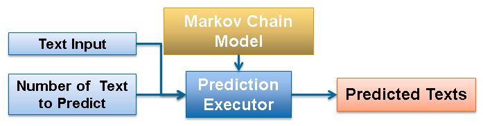

### Overview

Commonly, prediction is tightly associated with prevention. However prediction today is about the future!

The impact from applications derived out of words modelled statistically has improved the living quality for the various walks of life.

As examples,

1. SwiftKey Keyboard; the main motivator of this project is able to predict the next word as user types. For individuals who are always on the go; any composition task on mobile is a breeze with SwiftKey!

2. Text-To-Speech Synthesizer; assists user in speech construction even challenged by disability. This breaks down physical communication boundaries. (E.g. Stephen Hawkin)

--- .class #id 

### How It Works ?

`Markov Chain Model` is the main driver of this application. It represents each word as state with trasitional probabilities. As an example below, word "B" has 30% chance to transit to word "A".

   | A | B |
---|---|---|
 A | 0.6 | 0.4 |
 B | 0.3 | 0.7 |
     
 
`Add-1 Smoothing` is applied to distribute some of the high probability mass to words that have zero probability mass. The objective is to have a fairer prediction model.

`Shiny Application` embeds the `model` described above; along with the `Prediction Executor` and `User Interface`. The `High Level Architecture` as below,

--- .class #id 

### Too Easy To Use !

Type in some text and hit the `submit` button! Don't understand something? Hit the `Overview` tab!

Chrome Developer Tool; estimated time to service prediction request is `824.66ms`!

--- .class #id 

### What's Next ?

The current prediction model is somewhat skewed, below are tasks that could be carried out to improve the prediction model,

1. Increase Corpus size and/or type.
2. Cascade prediction model; this may improve prediction results.
3. Increase machine resource; be able to create more complex model.
4. Increase Shiny io resource; be able to host more complex text predictiona application.

Give this Text Prediction Application a try [here](https://yeongwei116.shinyapps.io/data-science-capstone/).

For more detailed information about the implementation, you may see [here](https://github.com/yeongwei/coursera-datascience-capstone).
